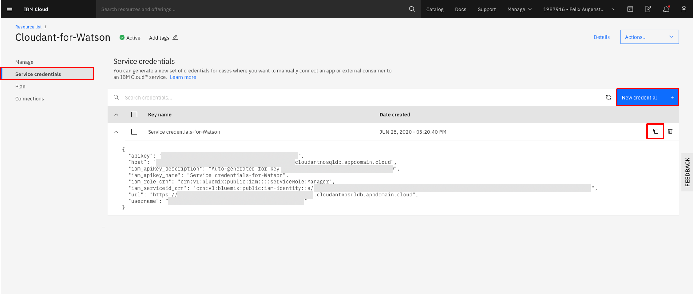
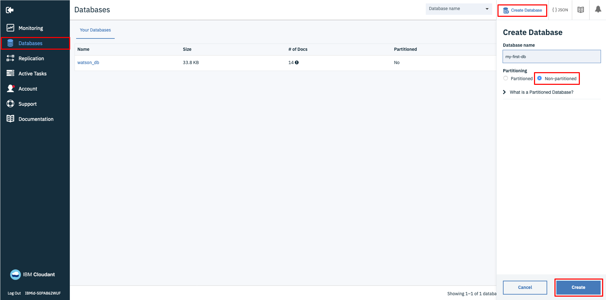
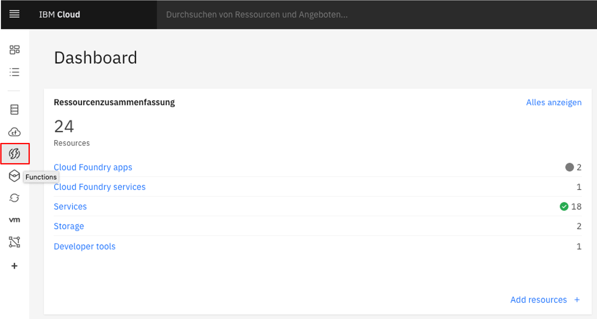
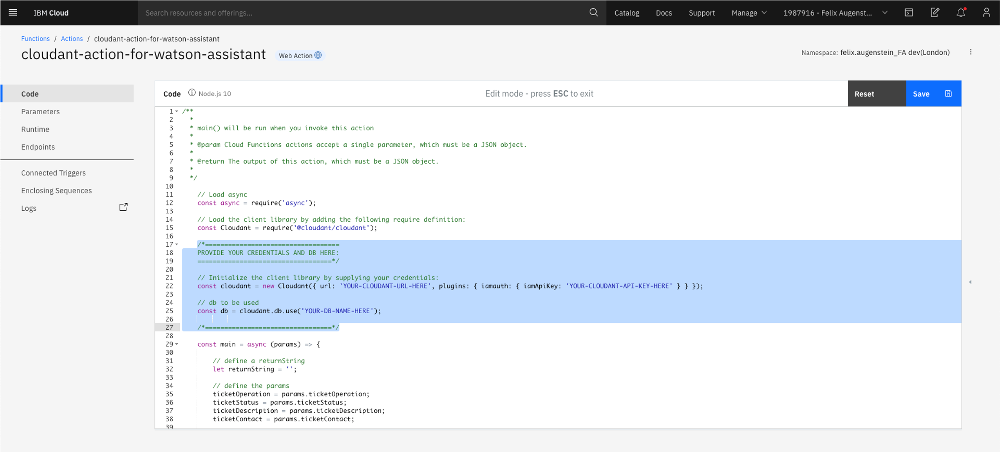
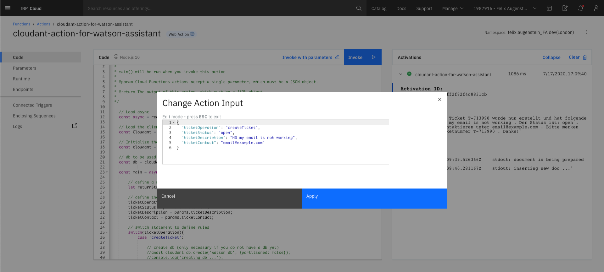
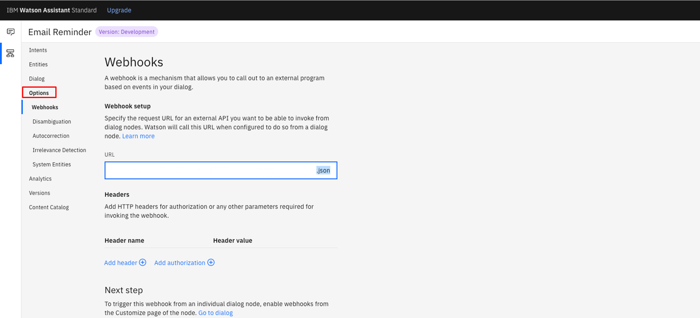
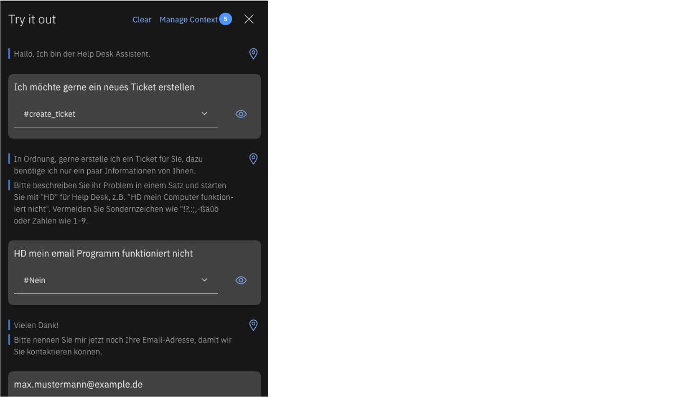

<h1 align="center" style="border-bottom: none;">:rocket: IBM Digital Tech Tutorial: Webhooks Part II</h1>
<h3 align="center">In this hands-on tutorial you will create demo for Watson Assistant that is able to create a ticket if you have any problems. This ticket is then saved to a Cloudant database and you can verify the ticket status.</h3>

## Prerequisites

1. Sign up for an [IBM Cloud account](https://cloud.ibm.com/registration).
2. Fill in the required information and press the „Create Account“ button.
3. After you submit your registration, you will receive an e-mail from the IBM Cloud team with details about your account. In this e-mail, you will need to click the link provided to confirm your registration.
4. Now you should be able to login to your new IBM Cloud account ;-)

## Digital Tech Tutorial Watson Assistant Webhooks Part I and II

This tutorial consists of 2 parts, you can start with part I or II.<br>
[Part I - Watson sends a reminder via e-mail](https://github.com/FelixAugenstein/digital-tech-tutorial-watson-assistant-webhooks)<br>
[Part II - Watson creates a ticket and saves it to a Cloudant database](https://github.com/FelixAugenstein/digital-tech-tutorial-watson-assistant-webhooks-part-ii/)

## Set up the Cloudant DB

After the login you will see your IBM Cloud Dashboard. Go to Catalog and select the Databases category under services or search for Cloudant. Then create a new Cloudant, the Lite Plan should work for this tutorial. As Authentication method choose IAM.


In your IBM Cloud Account go to the dashboard by clicking the IBM Logo in the upper left. Click on your new Cloudant service and select Service credentials to create new credentials. Copy them by clicking the copy button and save them for later.



Now go to Manage (above Service credentials), click Launch Dashboard and create a new non-partitioned Database. Remember your database name for later. (Optionally you can also create your database from a Terminal using your credentials or in a later step from your cloud function).



## Set up the cloud function

Go back to your IBM Cloud Dashboard. Click the Cloud Functions button, then go to Actions and click create, to create a new action.



Give your action a name, keep the Default Package and choose Node.js as your runtime. Click create.


Copy and paste the `ticket-system-with-cloudant-db.js` code and provide your credentials and database name. From your credentials copy and paste the url and apikey. Then copy and paste your database name.



Now you can test your Cloud Function to make sure everything works fine. Therefore save it and click Invoke with Parameters, provide the input below, and click Apply, then click Invoke. Results are shown in the Activations pane. (HD in the description stands for help desk).

```
{
  "ticketOperation": "createTicket",
  "ticketStatus": "open", 
  "ticketDescription": "HD my email is not working",
  "ticketContact": "email@example.com"
}
```



After testing you should see a new entry generated in your Cloudant database.
Go to Endpoints, enable it as a Web Action, save and copy the provided URL. You will need it later on, when setting up your Watson Assistant.


## Set up the Watson Assistant on the IBM Cloud

In your IBM Cloud Account go to the dashboard by clicking the IBM Logo in the upper left. Go to Catalog and select the AI / Machine Learning category under services or search for Watson Assistant. Then create a new Watson Assistant service, the Lite Plan should work for this tutorial. 


Afterwards launch your Watson Assistant Service, you will find it on your dashboard under services.

Go to skills and create a new skill, when asked choose the dialog skill. Select import skill and upload the `skill-Help-Desk-Webhook-and-CF.json` file.


Click options and then select Webhooks. Provide the Web Action URL you obtained when creating the Endpoint. Make sure to add a `.json` at the end.



Now you can go to the dialog and try it out for yourself. You can create a new ticket or verify the status of an existing ticket.




## If you have any questions just contact me
Felix Augenstein<br>
Digital Tech Ecosystem & Developer Representative @IBM<br>
Twitter: [@F_Augenstein](https://twitter.com/F_Augenstein)<br>
LinkedIn: [linkedin.com/in/felixaugenstein](https://www.linkedin.com/in/felixaugenstein/)
